# Area Chairs vs Paper Weights: What ACs Add, and How to AC Well

_Area chairs are not paper weights. But when AC judgment diverges from reviewer-score weighting, the reasoning has to be legible._ Dan Roy's one-line provocation, "Area chairs <= paper weights," is the right starting point because it turns a familiar complaint into a measurable question: how far do final decisions move away from simple reviewer-score aggregation, and when is that movement evidence of judgment rather than opacity?

This essay is both an audit and a guide to ACing. The audit measures how much reviewer-score weighting predicts public OpenReview decisions, then studies the cases where AC/PC judgment visibly overrides reviewer majority or unanimity. The guide asks what a good AC should do in exactly those boundary cases: audit review quality, make rebuttal discussion concrete, explain which evidence mattered, and leave a decision record that future authors, reviewers, and ACs can learn from.

_The test._ If we aggregate reviewer scores with a simple confidence weighting, do area-chair/meta-review decisions mostly reduce to paper weights, or do ACs visibly add judgment?

_Second inspiration._ Sarath Chandar's May 2, 2026 tweet sharpened the low-acceptance-regime question: what should we infer when a paper has three accept-leaning reviews but is rejected in a conference culture that often talks about keeping acceptance rates low, around the mid-20s? This pass treats that as a quantitative stress test, not as a hard-number claim or as a rule that three accept scores should mechanically force acceptance.

_Why this got more urgent._ Two newer X posts map accepted papers as global scoreboards: China Research Collective's ICLR 2026 institution/country treemap and Amit LeVi's fractional-author extension across NeurIPS, ICLR, and ICML 2025. They do not replace the ACs-vs-weights question; they raise its stakes. Top-conference accepts are read as career, institutional, and national capital, so thinly explained AC discretion is easily reduced to leaderboard narratives about where accepted papers cluster.

The answer is neither a simple indictment of ACs nor a defense of unexplained judgment. Reviewer scores are strongly predictive where the full public decision surface is visible, especially at ICLR. But the public data also shows a nontrivial set of AC/PC overrides: papers with majority-positive reviews that are rejected, and papers with majority-negative reviews that are accepted. That override set is where the review system does its most human work. It is also where venues owe authors, reviewers, and future ACs the clearest explanations.

## TLDR: Scores Predict, ACs Explain

<details open>
<summary>Expand/collapse the short version</summary>

Scores predict. They do not explain. In the cleanest public setting, ICLR, confidence-weighted reviewer scores carry a lot of signal; the story starts where scores and final decisions split: majority-accept rejects, majority-reject accepts, and low-confidence decisions that lean on someone else's review.

That split is where ACs earn trust or lose it. A good meta-review says what outweighed the scores, what changed after rebuttal, which reviews mattered, and what uncertainty remains. If the record does not say that, even a correct decision becomes unteachable.

The fix is to score service, not taste: expertise-gated AC bidding, mandatory rebuttal and override deltas, SAC repair queues before release, and author-controlled carry-forward for revised borderline rejects without importing old reviews or scores.

</details>

_Co-written with Codex._ This essay was developed with Codex as a research, coding, and editorial partner: fetching public OpenReview data, writing analysis scripts, building plots, packaging the Notion import, and tightening the narrative. The research question, interpretation, and final judgment remain human-directed; the quantitative claims are tied to local scripts, CSVs, and public sources rather than model memory.

_Disclosure and non-affiliation._ I am not affiliated with, advising, collaborating with, or writing on behalf of any author of the papers named or qualitatively discussed in this post. None of my own ML papers appears in the qualitative case analysis, named override examples, or paper-level case readings; the named cases are used only because their OpenReview records are public and illustrate process patterns. The separately labeled RLC anecdote is my own process experience, anonymized and kept outside the public-data qualitative sample.

## Claims and Evidence Map

| Claim | Evidence used here | What this does not prove |
| --- | --- | --- |
| Reviewer scores carry real signal. | Point-biserial correlations, AUC, and threshold accuracy across public ICLR/ICML/NeurIPS samples. | That scores are sufficient, calibrated across areas, or more important than review text. |
| AC/PC discretion materially changes some outcomes. | Majority-signal override counts and strong unanimous-reviewer override counts. | That every override is good or bad; only that the override surface is large enough to audit. |
| Public rationale quality is the central governance variable. | Meta-review availability, rationale word-count features, rebuttal/review-synthesis markers, nested forum-discussion counts, and case-level reason tags. | That private AC work was absent when public rationale is thin. |
| The rough 25% acceptance story is incomplete. | Official acceptance-rate comparison, post-withdrawal public decision pools, and 3+ accept-vote capacity counterfactuals. | That any paper with three accept-leaning reviews should automatically be accepted. |
| Accepted-paper leaderboards raise the stakes. | Public affiliation and country-distribution posts for ICLR/ICML/NeurIPS accepted papers. | That country or institution share explains any paper-level decision. |
| AC matching should privilege expertise and interest. | Borderline accept-to-reject cases with short or weakly structured public rationale, plus qualitative examples requiring domain judgment. | That text length proves low expertise or that every terse reject was wrong. |
| Better incentives should score service, not taste. | High-risk decision flags, missing-rationale patterns, and reciprocal-service precedents. | That we can objectively know the "right" decision after the fact. |

## What Was Measured

- Review score: first numeric value in the public `rating`, `recommendation`, or `overall_recommendation` field.
- Simple weighting: confidence-weighted mean score, using reviewer confidence when present and unit weight otherwise.
- Reviewer accept signal: score at or above a venue-specific threshold (`6` for ICLR, `3` for ICML 2025, `4` for NeurIPS 2025).
- AC override proxy: final public accept/reject decision disagrees with the reviewer-majority signal.
- Strong override: all scored reviewers point one way and the final decision points the other.
- Ethical constraint: AC identities are not deanonymized. The report highlights public paper cases and anonymized meta-review behavior, not named ACs.
- Conflict-of-interest constraint: I am not associated with any authors of the papers named or qualitatively discussed here, and my own ML papers do not appear in the qualitative case analysis.

## Venue Coverage

| Venue | OpenReview domain | Accept-score threshold | Public-data interpretation |
| --- | --- | --- | --- |
| ICLR 2026 | ICLR.cc/2026/Conference | 6.0 | Full public submissions on OpenReview, including accepted/rejected/withdrawn where public notes expose decisions. |
| ICLR 2025 | ICLR.cc/2025/Conference | 6.0 | Full public submissions on OpenReview, including accepted/rejected/withdrawn where public notes expose decisions. |
| ICLR 2024 | ICLR.cc/2024/Conference | 6.0 | Full public submissions on OpenReview, including accepted/rejected/withdrawn where public notes expose decisions. |
| ICML 2025 | ICML.cc/2025/Conference | 3.0 | Public OpenReview sample: accepted papers plus public rejected papers; rejected sample is not the full submission pool. |
| NeurIPS 2025 | NeurIPS.cc/2025/Conference | 4.0 | Public OpenReview sample: accepted papers plus public rejected papers; rejected sample is not the full submission pool. |

Context-only venues excluded from aggregate tables: AISTATS 2026, RLC 2025, AAAI 2025. They are useful process references, but their public OpenReview surfaces did not expose comparable review-score and meta-review data for this audit; showing zero-filled rows would be misleading.

## Quantitative Results

| Venue | Public papers | With scores | Analyzable A/R | Accept/Reject | Point-biserial r | AUC | Weighted threshold acc. | Maj. accept->reject / reject->accept | All accept->reject / reject->accept |
| --- | --- | --- | --- | --- | --- | --- | --- | --- | --- |
| ICLR 2026 | 19814 | 19474 | 13723 | 5352/8371 | 0.629 | 0.889 | 0.708 | 481/919 | 12/73 |
| ICLR 2025 | 11672 | 11520 | 8614 | 3703/4911 | 0.707 | 0.944 | 0.880 | 894/97 | 70/3 |
| ICLR 2024 | 7404 | 7262 | 5691 | 2260/3431 | 0.697 | 0.938 | 0.868 | 582/71 | 74/6 |
| ICML 2025 | 3422 | 3422 | 3422 | 3260/162 | 0.298 | 0.812 | 0.832 | 83/70 | 32/0 |
| NeurIPS 2025 | 5540 | 5540 | 5540 | 5286/254 | 0.369 | 0.829 | 0.876 | 142/12 | 61/1 |

Interpretation:

- ICLR is the cleanest measurement setting because rejected papers are broadly public. Across 2024-2026, the confidence-weighted score is highly correlated with the final decision, but hundreds of majority-signal overrides remain visible.
- ICML 2025 and NeurIPS 2025 show high simple-rule accuracy in the public sample, but the sample is dominated by accepted papers. The small public-rejected slice should not be treated as representative of all rejects, and public meta-review rationales are not exposed for the highlighted overrides.
- AISTATS 2026, RLC 2025, and AAAI 2025 are not counted in this table. They appear only in caveats/sources because the public surfaces did not expose enough comparable review or meta-review structure for this audit.


Important ICLR 2026 context: the official ICLR retrospective says the review process was disrupted by an OpenReview security incident, after which review scores were reset to the pre-rebuttal state, some AC work was reassigned, and ACs were asked to infer the expected outcome had discussion proceeded normally. That makes ICLR 2026 both valuable and unusual: it is a stress test of AC discretion, but not a clean year for interpreting public reviewer scores as final reviewer intent.

## Visual Argument

The first thing to notice is that reviewer scores are not decorative. A simple confidence-weighted score ranks accepted papers above rejected papers surprisingly well, especially in ICLR 2024 and 2025. That is the part of the "paper weights" intuition that is basically right: if all we know is the public score vector, we already know a lot about the final outcome.

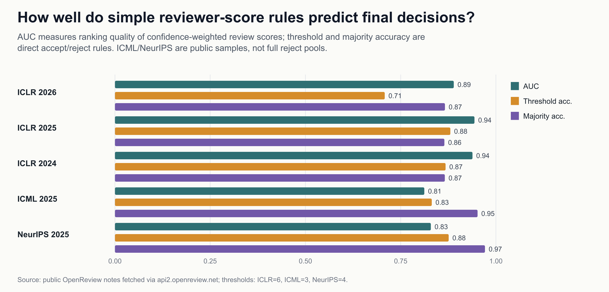

Here is a small score-weight transfer playground, included as a fun transfer sanity check rather than a validation claim. Learn the best confidence-weighted score cutoff on one ICLR year, apply that same cutoff to another ICLR year, and ask whether the rule travels well enough to make the AC override zone visible. The interesting column is the last one: near the learned gate, target-year accept-to-reject cases are exactly where borderline papers can suffer under selective acceptance pressure.

| Learn cutoff on | Apply to | learned cutoff | source balanced acc. | target acc. | target accept recall | target reject recall | near-cutoff accept->reject cases |
| --- | --- | --- | --- | --- | --- | --- | --- |
| ICLR 2024 | ICLR 2025 | 5.68 | 0.869 | 0.870 | 0.904 | 0.844 | 470 |
| ICLR 2024 | ICLR 2026 | 5.68 | 0.869 | 0.730 | 0.328 | 0.987 | 67 |
| ICLR 2025 | ICLR 2024 | 5.74 | 0.876 | 0.864 | 0.854 | 0.871 | 220 |
| ICLR 2025 | ICLR 2026 | 5.74 | 0.876 | 0.724 | 0.310 | 0.989 | 59 |
| ICLR 2026 | ICLR 2024 | 4.68 | 0.806 | 0.664 | 0.993 | 0.447 | 111 |
| ICLR 2026 | ICLR 2025 | 4.68 | 0.806 | 0.672 | 0.993 | 0.430 | 165 |

But prediction is not the same as governance. The interesting cases are the ones where the final decision moves against the reviewer-majority signal. Those are not rare enough to dismiss as clerical noise. In ICLR 2024 and 2025 especially, hundreds of papers sit in the region where the AC/PC decision visibly changes the outcome relative to a simple majority rule.

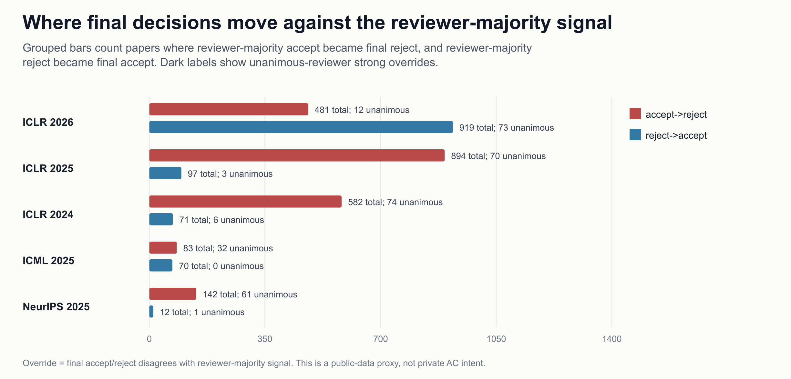

The reason this can happen is visible in the score distributions. Accepted and rejected ICLR papers separate in the aggregate, but they overlap around the threshold. That overlap is the real decision surface. On one side are papers with apparently positive scores but unresolved novelty, correctness, or evaluation problems. On the other are papers with mixed scores where the AC appears to have decided that the written concerns were either answerable or outweighed by the contribution.

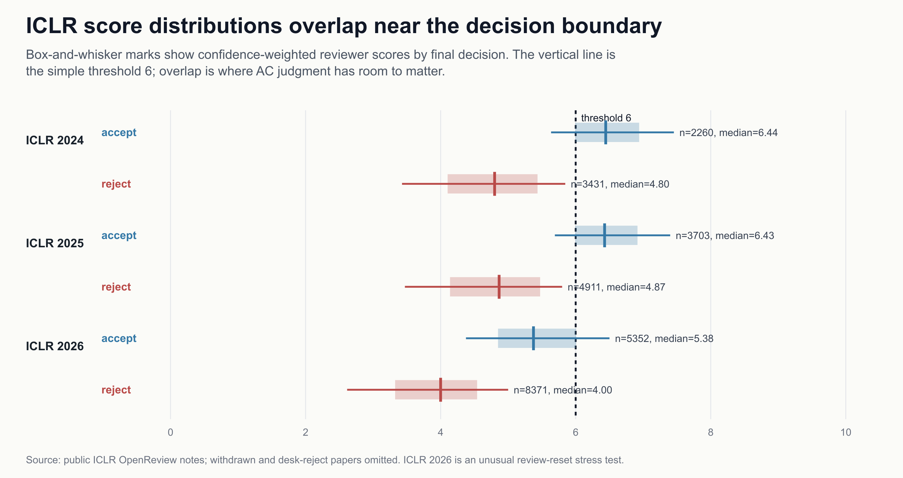

This turns the question into a transparency question. When an AC overrides the reviewer-majority signal, do we get a public rationale strong enough to learn from? In this fetched sample, availability alone is nearly saturated, so the plot below uses a stricter public-evidence screen: longer rationales score higher when they also mention reviews, rebuttal, and why the decision moved. These bins are not judgments about decision correctness. Separately, the parser now captures nested public forum discussion: among 36,990 analyzable accept/reject papers, 34,758 have at least one public non-review/non-decision discussion note after excluding administrative acknowledgements and withdrawals, 28,636 have reviewer follow-up, and 34,569 have author response. Those notes are engagement evidence, not a substitute for final rationale.

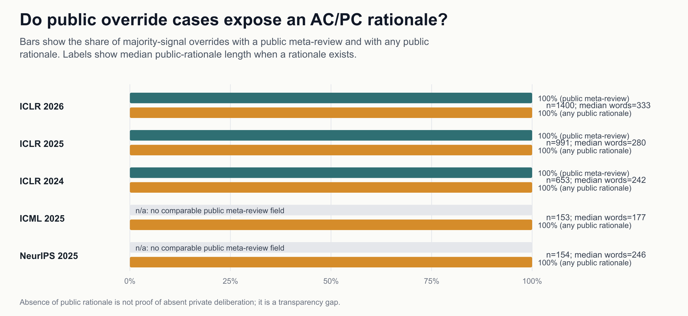

For ICLR, the public rationales can be coded into broad topic mentions. The assumption matters: these are regex-coded, multi-label flags over public rationale text, not sentiment labels, causal proof, or a claim that the same theme means the same thing in both directions. A novelty phrase in an accept-to-reject case can mean "the contribution was not novel enough"; a novelty phrase in a reject-to-accept case can mean "the AC found enough novelty despite reviewer concern." The improved plot therefore shows directional lift rather than two nearly identical frequency bars. The main result is that broad issue classes recur in both directions, while calibration/review-quality, evidence/baselines, and implementation/reproducibility tilt more toward reject-to-accept overrides.

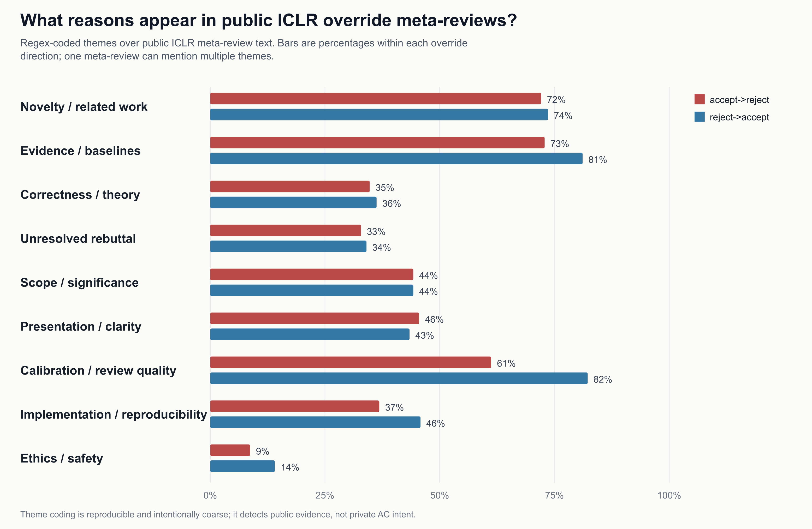

An unsupervised pass over the public ICLR override meta-reviews tells the same story in another way. The clusters are coarse, exploratory groupings, not stable reason taxonomies. Where two clusters share a parent label, the plot now disambiguates them with top terms rather than implying that k-means found a clean ontology. The value is to turn thousands of borderline decisions into a process map that still points back to individual public records.

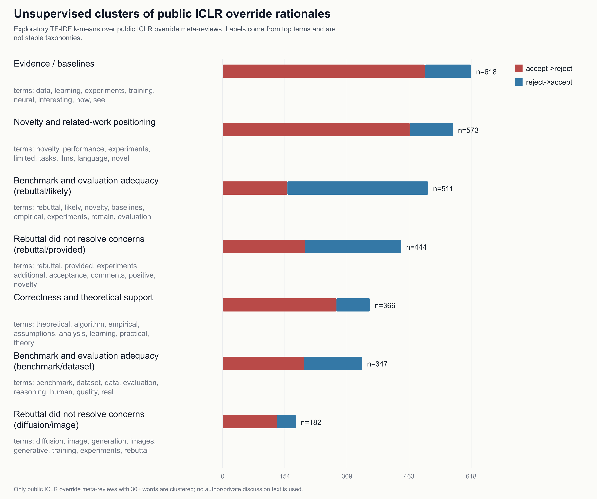

The guideline question is sharper. AC guides generally ask ACs to synthesize reviews, manage discussion, assess rebuttal, and justify decisions. Public ICLR meta-reviews often show evidence of this behavior, especially for override cases. The saturated rows in the scorecard are sanity checks; the more informative rows are rebuttal handling, balanced strengths/weaknesses, and causal justification. The metric here is deliberately conservative: it measures public evidence of guideline-like behavior, not private compliance.

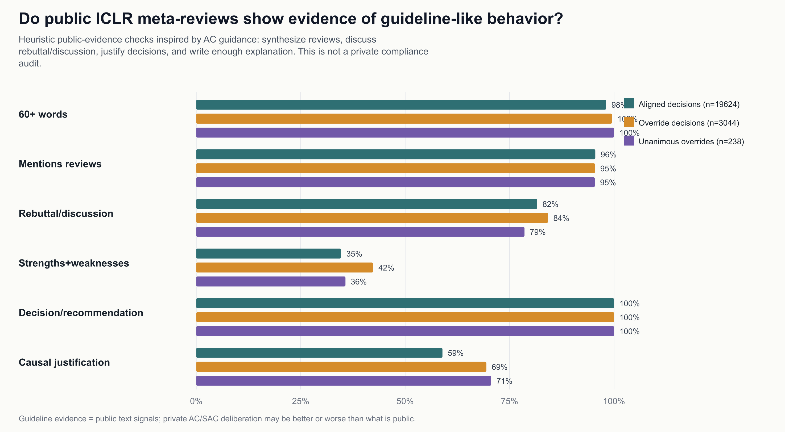

The hardest cases are unanimous-reviewer overrides. If all reviewers point one way and the AC/PC moves the other way, the public explanation should be unusually explicit. The data shows a mixed picture: many ICLR unanimous overrides have strong public rationale signals, but not all of them do. This plot is a high-bar public-record screen, not a claim that the decisions were right or wrong. It marks exactly where conferences should require a structured decision delta.

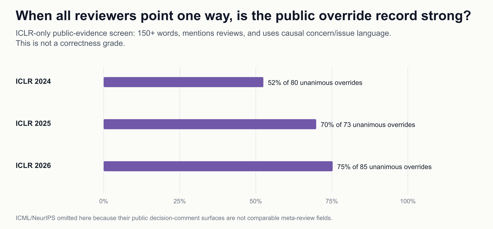

The low-acceptance-rate story needs its own denominator check. Official acceptance rates are calculated over submitted or valid papers. ACs often experience a later decision pool after withdrawals and desk rejects. Official rates in the sources here run roughly 24-32% for the main comparable venues, and ICLR's later public pool has a substantially higher accept share than the headline acceptance rate. So the budget pressure is real, but a literal "25% of fully reviewed papers" interpretation is too crude.

The strongest version of the critique is: what happens when a paper gets at least three accept-leaning reviews? The answer is not "always accept." ICLR still rejects a meaningful minority of those papers, and the public rationales often point to novelty, correctness, missing evidence, or calibration concerns. The better norm is not a mechanical 3-accept rule; it is a high-rationale burden for rejecting such papers.

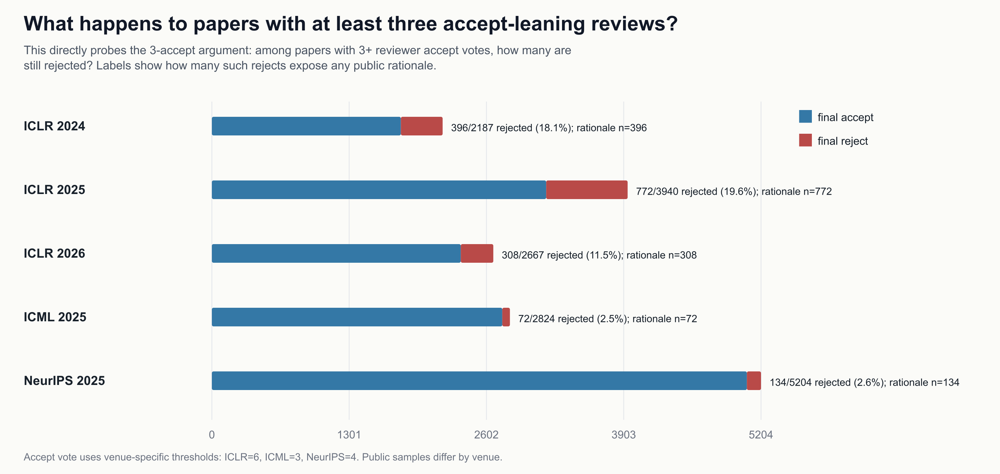

The capacity question can be made more precise. If every paper with at least three accept-leaning public reviews were accepted first, would that alone overflow the official accept budget? Usually no. ICLR 2025 is the clearest pressure case: the 3+ accept-vote set is slightly larger than the official accept count. ICLR 2024 and 2026 do not show that arithmetic pressure in the same way.

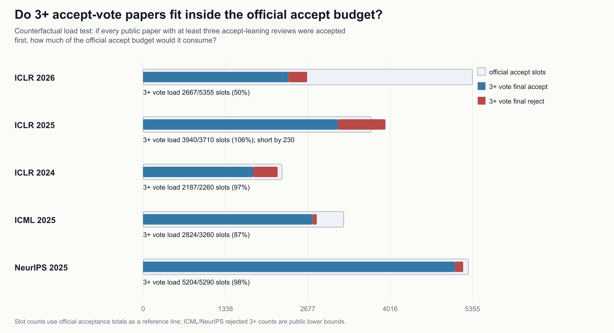

That leads to a useful accountability split. Some 3+ accept-vote rejections may be unavoidable under a hard slot budget, but many are not forced by slot arithmetic. Those cases can still be correct decisions; the point is that their explanation burden is higher because capacity alone does not explain the outcome.

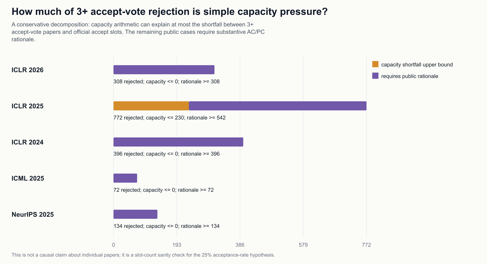

The requested NeurIPS case, SophiaVL-R1, shows the distinction cleanly. It has four accept-leaning public scores and a final reject. The public decision comment is substantive and points to empirical/significance concerns, but there is no separate public meta-review exposed in the ICLR-style structure. That makes it a useful transparency case: the rationale is not absent, but it is harder to compare systematically with AC-guideline expectations.

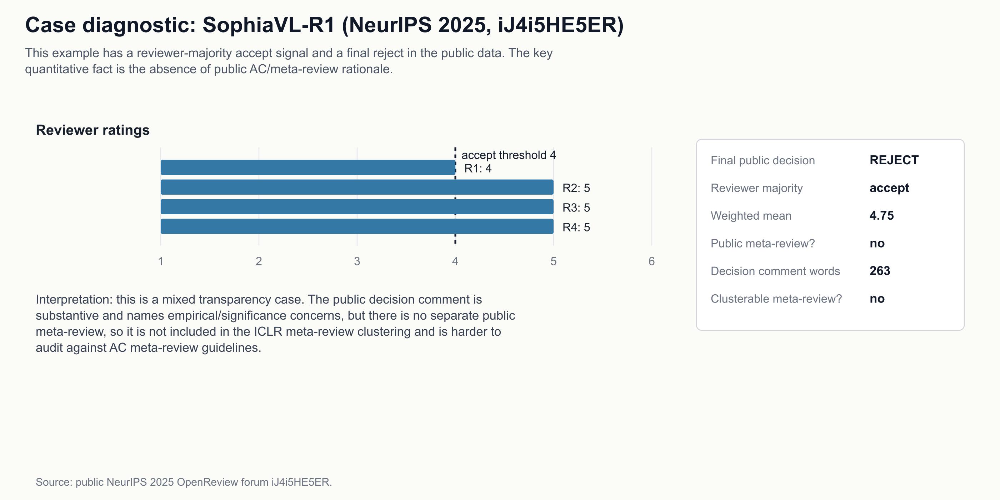

The new meta-review layer covers 3,044 public ICLR majority-signal override cases, of which 3,044 expose a public meta-review. The unsupervised reason clustering uses 3,041 public ICLR override meta-reviews with at least 30 words.


## Representative Override Cases

The full CSVs keep the exhaustive paper-level records. The blog should not read like a dump of every named override, so this section keeps only representative public cases: high-score rejects, low-score accepts, and a small cross-venue sample where the public rationale can teach future ACs what the decision turned on.

### Majority reviewer accept -> final reject

- [Unified Cross-Scale 3D Generation and Understanding via Autoregressive Modeling](https://openreview.net/forum?id=mnI8CFj2WP) (ICLR 2026, #8646): scores 4 8 6 10, threshold 6.0, confidence-weighted mean 7.00, reviewer majority accept, final reject. Public rationale: public meta-review and decision comment; themes: Novelty / related work, Correctness / theory, Unresolved rebuttal, Scope / significance, Presentation / clarity.
- [Auto-Regressive Surface Cutting](https://openreview.net/forum?id=9HeKCYl1zl) (ICLR 2026, #12546): scores 6 10 4 6, threshold 6.0, confidence-weighted mean 6.88, reviewer majority accept, final reject. Public rationale: public meta-review and decision comment; themes: Novelty / related work, Evidence / baselines, Unresolved rebuttal, Scope / significance, Calibration / review quality.
- [Gymnasium: A Standard Interface for Reinforcement Learning Environments](https://openreview.net/forum?id=feFlfuOse1) (ICLR 2025, #5227): scores 5 10 6 8, threshold 6.0, confidence-weighted mean 7.80, reviewer majority accept, final reject. Public rationale: public meta-review and decision comment; themes: Novelty / related work, Evidence / baselines, Scope / significance, Calibration / review quality.
- [A is for Absorption: Studying Feature Splitting and Absorption in Sparse Autoencoders](https://openreview.net/forum?id=LC2KxRwC3n) (ICLR 2025, #8043): scores 8 6 8 8, threshold 6.0, confidence-weighted mean 7.57, reviewer majority accept, final reject. Public rationale: public meta-review and decision comment; themes: Novelty / related work, Evidence / baselines, Scope / significance, Presentation / clarity, Calibration / review quality.
- [Differentiable Trajectory Optimization as a Policy Class for Reinforcement and Imitation Learning](https://openreview.net/forum?id=HL5P4H8eO2) (ICLR 2024, #1693): scores 8 6 8 10, threshold 6.0, confidence-weighted mean 8.13, reviewer majority accept, final reject. Public rationale: public meta-review and decision comment; themes: Novelty / related work, Calibration / review quality.
- [Flexible Residual Binarization for Image Super-Resolution](https://openreview.net/forum?id=MEbNz44926) (ICLR 2024, #1953): scores 8 8 8 8, threshold 6.0, confidence-weighted mean 8.00, reviewer majority accept, final reject. Public rationale: public meta-review and decision comment; themes: Novelty / related work, Calibration / review quality.
- [$Q\sharp$: Provably Optimal Distributional RL for LLM Post-Training](https://openreview.net/forum?id=1J1Kju4rto) (ICML 2025, #5010): scores 4 4 4, threshold 3.0, confidence-weighted mean 4.00, reviewer majority accept, final reject. Public rationale: decision comment; themes: Novelty / related work, Evidence / baselines, Correctness / theory, Scope / significance, Implementation / reproducibility.
- [Aya Vision: Advancing the Frontier of Multilingual Multimodality](https://openreview.net/forum?id=BJBje1IHI9) (NeurIPS 2025, #10890): scores 6 5 5 5, threshold 4.0, confidence-weighted mean 5.21, reviewer majority accept, final reject. Public rationale: decision comment; themes: Novelty / related work, Evidence / baselines, Scope / significance, Calibration / review quality.

### Majority reviewer reject -> final accept

- [PLAGUE: Plug-and-play Framework for Lifelong Adaptive Generation of Multi-turn Jailbreaks](https://openreview.net/forum?id=05hNleYOcG) (ICLR 2026, #9695): scores 2 2 4 2, threshold 6.0, confidence-weighted mean 2.35, reviewer majority reject, final accept. Public rationale: public meta-review and decision comment; themes: Novelty / related work, Evidence / baselines, Presentation / clarity.
- [System 1.x: Learning to Balance Fast and Slow Planning with Language Models](https://openreview.net/forum?id=zd0iX5xBhA) (ICLR 2025, #8744): scores 5 6 3 1, threshold 6.0, confidence-weighted mean 3.56, reviewer majority reject, final accept. Public rationale: public meta-review and decision comment; themes: Novelty / related work, Evidence / baselines, Correctness / theory, Unresolved rebuttal, Scope / significance.
- [Reclaiming the Source of Programmatic Policies: Programmatic versus Latent Spaces](https://openreview.net/forum?id=NGVljI6HkR) (ICLR 2024, #6536): scores 3 3 5, threshold 6.0, confidence-weighted mean 3.73, reviewer majority reject, final accept. Public rationale: public meta-review and decision comment; themes: Novelty / related work, Correctness / theory.
- [Latent Preference Coding: Aligning Large Language Models via Discrete Latent Codes](https://openreview.net/forum?id=ZWZLYVFgDL) (ICML 2025, #3233): scores 3 2 1 1, threshold 3.0, confidence-weighted mean 1.75, reviewer majority reject, final accept. Public rationale: decision comment; themes: Novelty / related work, Correctness / theory, Scope / significance.
- [Convergence of Clipped SGD on Convex $(L_0,L_1)$-Smooth Functions](https://openreview.net/forum?id=VyjFOO9cFi) (NeurIPS 2025, #10891): scores 2 3 2 5, threshold 4.0, confidence-weighted mean 2.71, reviewer majority reject, final accept. Public rationale: decision comment; themes: Novelty / related work, Evidence / baselines, Correctness / theory, Scope / significance, Presentation / clarity.

These examples are not claims that the final decisions were wrong. They are examples of where public explanation quality matters most: if a decision moves against reviewer majority, the decision record should show what evidence outweighed the scores.


## Acceptance-Rate Pressure Readout

Inspired by Sarath Chandar's May 2, 2026 tweet about three accept-leaning reviews and selective conference acceptance rates, I added a base-rate and capacity-counterfactual analysis. I do not read the tweet as asserting a hard 25% rule; the safer framing is a low-acceptance regime where official rates in the comparable sources run roughly 24-32%. The safe reading is not "three accepts should automatically accept the paper." The safe reading is: if a paper has three or more accept-leaning reviews and is still rejected, the AC/PC rationale should be unusually legible, because authors and future ACs will naturally ask whether the decision was about paper substance, review calibration, or acceptance-budget pressure.

The first distinction is denominator choice. Official acceptance rates use submitted or valid papers. ACs often experience a later decision pool after desk rejects and withdrawals. For ICLR, that means an official 27-32% acceptance rate can coexist with a roughly 37-43% accept share among public non-withdrawn decision cases. That does not remove budget pressure, but it makes a literal "only 25% of fully reviewed papers can pass" story too crude.

Relative to a low-acceptance reference line:

- ICLR 2026: official rate 27.4%, +474 accepted papers relative to a 25% reference line.
- ICLR 2025: official rate 32.1%, +819 accepted papers relative to a 25% reference line.
- ICLR 2024: official rate 31.0%, +444 accepted papers relative to a 25% reference line.
- ICML 2025: official rate 26.9%, +233 accepted papers relative to a 25% reference line.
- NeurIPS 2025: official rate 24.5%, -104 accepted papers relative to a 25% reference line.
- AISTATS 2026, RLC 2025, and AAAI 2025 are excluded from this arithmetic because comparable public review-score/meta-review data were unavailable.

The strongest empirical version of the concern is the "3 accepts" test:

- ICLR 2026: 308/2667 public papers with 3+ accept-leaning reviews were rejected (50% of official accept slots; full public ICLR surface).
- ICLR 2025: 772/3940 public papers with 3+ accept-leaning reviews were rejected (106% of official accept slots; full public ICLR surface).
- ICLR 2024: 396/2187 public papers with 3+ accept-leaning reviews were rejected (97% of official accept slots; full public ICLR surface).
- ICML 2025: 72/2824 public papers with 3+ accept-leaning reviews were rejected (87% of official accept slots; public lower bound).
- NeurIPS 2025: 134/5204 public papers with 3+ accept-leaning reviews were rejected (98% of official accept slots; public lower bound).

The second distinction is capacity arithmetic. Ask a counterfactual question: if every public paper with 3+ accept-leaning reviews were accepted first, would the conference exceed its official accept count?

- ICLR 2026: capacity arithmetic can explain at most 0 of those 308 rejections; at least 308 require a substantive paper-level rationale.
- ICLR 2025: capacity arithmetic can explain at most 230 of those 772 rejections; at least 542 require a substantive paper-level rationale.
- ICLR 2024: capacity arithmetic can explain at most 0 of those 396 rejections; at least 396 require a substantive paper-level rationale.
- ICML 2025: capacity arithmetic can explain at most 0 of those 72 rejections; at least 72 require a substantive paper-level rationale.
- NeurIPS 2025: capacity arithmetic can explain at most 0 of those 134 rejections; at least 134 require a substantive paper-level rationale.

The gating pressure shows up most clearly in near-threshold accept-to-reject decisions, not in the existence of a single numerical cap. These are papers with reviewer evidence strong enough to sit near a simple score gate but final reject after AC/PC synthesis. If a later version addresses the stated decision-critical concern, an author-controlled revision carry-forward should prioritize it for high-expertise matching and early delta review at the next venue. That gives revised borderline work a chance at cleaner conversion, not a promise of acceptance.

The newer accepted-paper distribution posts add a different pressure point. China Research Collective's ICLR 2026 treemap presents accepted papers as a country/institution map, with China (Mainland) at 43.7%, the USA at 31.9%, Hong Kong at 7.7%, and Singapore at 5.5% in that visualization. Amit LeVi's fractional-author extension makes the same kind of public scoreboard across NeurIPS, ICLR, and ICML 2025; in that chart, China and the United States are the top two countries in all three venues, with the order flipping by conference.

I would not use those charts to infer anything about a specific AC decision. Their value is qualitative: they show how quickly review outcomes become status metrics for labs, countries, and careers. That raises the cost of opaque discretion. If ACs are doing real synthesis work, the community needs to see enough of that synthesis to avoid two oversimplified stories: "the process is mostly noise" and "the leaderboard itself explains merit."

The newer submission-scale argument, inspired by Ayan Banerjee's LinkedIn post, is different from the three-accept complaint. Taking the close-to-40k NeurIPS submission scale as given, the post asks whether, after a minimum quality threshold, review noise makes each non-desk-rejected paper behave like an approximately equal-probability trial. The repeated-submission math is correct under that assumption: with per-paper acceptance probability 0.267, six independent submissions give an 84.5% chance of at least one acceptance, and ten give 95.5%. The stated 81% figure corresponds more closely to NeurIPS 2025's official 24.5% acceptance rate, where six independent submissions give 81.5% and ten give 94.0%.

The empirical question is whether the equal-probability premise holds. The public data cannot observe latent paper quality directly, but it can test whether reviewer-score evidence is nearly flat after a minimum threshold. It is not. Using the proposed ICLR-style rule, "three reviews, average at least 6.49, and at most one reviewer below 6," an iid draw from public ICLR reviewer-score marginals gives a qualifying probability of 14.4% for ICLR 2025 and 12.8% for ICLR 2024, not 26.7%. Conditional on actually satisfying that rule among observed exact-three-review public papers, the final accept rate was 97.8% in ICLR 2025 and 96.7% in ICLR 2024. Weighted-score buckets are also sharply monotone: ICLR 2025 papers with weighted means 5-6 were accepted 24.4%, 6-6.49 were accepted 82.4%, 6.49-7 were accepted 94.8%, and 7-8 were accepted 98.1%.

The verified version of the post's point is therefore not "quality does not matter." It is: at massive submission scale, even a noisy-but-informative review process can make repeated marginal submission strategically powerful, especially if LLMs reduce the cost of producing many non-desk-rejected papers. That weakens "number of top-conference accepts" as a proxy for research depth. It also raises the burden on ACs and venues: preserving signal requires review-quality auditing, explicit rationale for high-risk decisions, and enough public reasoning that repeated draws are not mistaken for a clean measure of research depth.

Interpretation: low acceptance rates create real pressure at the margin, and ICLR 2025 shows a concrete version of it. But capacity arithmetic alone cannot explain most public 3+ accept-vote rejections in the audited years. That supports a stronger transparency norm: if an AC/PC rejects a paper with 3+ accept-leaning reviews, the public rationale should say what outweighed the scores: novelty, correctness, missing evidence, review calibration, unresolved rebuttal, area calibration, or another explicit reason.

## Guideline-Compliance Readout

The public AC guidelines are directionally consistent across venues: ACs should synthesize reviewer evidence, manage discussion, assess author response/rebuttal, write a meta-review that explains the decision, and explicitly justify decisions that go against reviewer signals. RLC's process is more structural: SACs can reject against senior-reviewer consensus only with PC review, and accepted papers are expected to have SAC/SR agreement.

The data can test only public evidence of those norms, not private compliance. On public ICLR override cases, review-synthesis language appears in 95% of public meta-reviews, while rebuttal/discussion language appears in 84%. The broader nested-thread audit finds public discussion notes in 99% of ICLR override cases, reviewer follow-up in 82%, and author responses in 99%. For unanimous-reviewer overrides, 157/238 have a stronger public rationale signal: a 150+ word meta-review that mentions reviews and gives causal concern/issue language.

The requested example, [SophiaVL-R1](https://openreview.net/forum?id=iJ4i5HE5ER), is therefore a useful negative control: it has public scores `5 5 5 4`, reviewer majority `accept`, final `reject`, `263` public decision-comment words, and theme tags `Evidence / baselines, Correctness / theory, Scope / significance, Presentation / clarity, Implementation / reproducibility`. It cannot be assigned to the ICLR meta-review clusters because NeurIPS exposes a decision comment here, not a separate public meta-review.

### Reason Clusters

The unsupervised ICLR meta-review clusters are not a substitute for reading the cases, but they turn thousands of AC decisions into a map of recurring judgment moves:

- Evidence / baselines: 618 cases; top terms `data, learning, experiments, training, neural, interesting, how, see`.
- Novelty and related-work positioning: 573 cases; top terms `novelty, performance, experiments, limited, tasks, llms, language, novel`.
- Benchmark and evaluation adequacy: 511 cases; top terms `rebuttal, likely, novelty, baselines, empirical, experiments, remain, evaluation`.
- Rebuttal did not resolve concerns: 444 cases; top terms `rebuttal, provided, experiments, additional, acceptance, comments, positive, novelty`.
- Correctness and theoretical support: 366 cases; top terms `theoretical, algorithm, empirical, assumptions, analysis, learning, practical, theory`.


### Case Reading: SophiaVL-R1

The quantitative signature is simple: four public reviews are accept-leaning under the NeurIPS threshold, the confidence-weighted mean is 4.75, and the final decision is reject. The public decision comment is not empty or generic; it gives a substantive critique. In plain language, the rejection rationale centers on modest gains against a matched GRPO baseline, limited evidence that the thinking-reward component independently helps, insufficient reliability analysis for the reward signal, and a presentation/table-consistency issue.

That makes the case more instructive than a missing-rationale case. It shows a plausible kind of reviewer-majority override: the AC/PC may decide that reviewers liked the direction but did not price a specific baseline or ablation concern strongly enough. The public weakness is structural, not necessarily substantive: without a separate meta-review field, it is harder to tell which reviewer concerns were upweighted, whether reviewers updated after rebuttal, and whether the final decision differed from the AC's initial decision hypothesis.

For a future AC, the teachable version of this decision would say: "Reviewer support was real, but the decisive unresolved issue was X; the rebuttal addressed Y but not Z; therefore I am downweighting the numeric majority for reasons A and B." That is the standard this post argues for across venues.

### AC Story Archetypes

The data should not be read as a scoreboard of individual ACs. It is better read as a library of process stories. Five archetypes are especially useful for future ACs:

1. _The evidence-synthesizing override._ The reviewer-majority signal points one way, but the meta-review names a decisive issue, connects it to review text, and explains why rebuttal/discussion did or did not resolve it. This is the strongest form of AC discretion.
2. _The calibration rescue._ Reviewers use scores inconsistently, or one strong review is numerically outvoted by weaker reviews. A good AC makes the calibration judgment explicit instead of hiding it behind the final decision.
3. _The budget-shadow decision._ A paper looks acceptable in isolation, but the venue bar or area calibration is invoked implicitly. These cases are not necessarily illegitimate, but they are the ones most in need of transparent comparison language.
4. _The unteachable decision._ The final outcome diverges from reviewer evidence, but the public record does not explain what mattered. This is the failure mode the incentive proposal targets: not harshness, but missing institutional memory.
5. _The expertise bottleneck._ The final call depends on a domain-specific judgment that reviewers did not settle: benchmark adequacy, formal guarantees, theorem assumptions, domain realism, safety bar, or novelty relative to a narrow literature. These are the cases where AC matching matters before the review even starts.


### Why AC Matching Should Be Expertise- and Interest-Gated

The case for high-expertise, high-interest AC matching is strongest exactly where paper weights are weakest: borderline majority-accept papers that the AC/PC rejects. In the public sample, 556 accept-to-reject cases sit within 0.75 points of the venue accept threshold with at least three scored reviews. Of those, 51 have fewer than 120 public rationale words, 144 have no rebuttal/discussion marker in the meta-review or decision text, and 41 have no public review-synthesis marker.

The nested-discussion pass changes the interpretation without removing the concern. Within the same borderline set, 550 cases have at least one public discussion note, 508 have reviewer follow-up, 549 have author responses, and 50 have AC/PC-authored public discussion comments. That means visible engagement sometimes exists outside the final rationale field; the audit question is whether the final public rationale explains how that engagement changed the decision.

That is not evidence about individual AC expertise. It is evidence that low-context public explanations make expertise hard to audit. The short-rationale cases are not generic: their recurring themes are novelty / related work (24), evidence / baselines (18), calibration / review quality (11), implementation / reproducibility (9), presentation / clarity (7). The decisive issues often require field taste and technical fluency: whether a causal-discovery permutation test really needs stronger exchangeability justification, whether a multilingual benchmark measures a new failure mode rather than dataset surface form, whether a privacy defense needs formal guarantees, whether regenerating recommender-system data violates the domain's realism assumptions, or whether an LLM/generalization claim is only recombining existing theory. Those are poor fits for an AC assignment made mainly for load balancing or weak topical overlap.

The practical norm is direct: AC bidding is part of review quality, not scheduling metadata. An AC should bid high only when they have enough domain expertise to identify the live technical issue and enough interest to run the discussion. If a paper is borderline and the assigned AC cannot write a specific decision-critical question before rebuttal, the system should reassign it or add a domain co-AC/SAC before the final decision. Otherwise, a legitimate expert veto and a weakly documented low-engagement reversal can look the same to authors: a score-positive paper turned into a reject with too little explanation to learn from.

There is a second-cycle version of the same problem. A borderline accept-to-reject paper should not have to restart from institutional amnesia at the next conference if the authors have materially addressed the decision-critical concern. Resharing old reviews or scores would create anchoring bias and should not become a portable shadow record. But conference management teams should explore an author-controlled revision carry-forward: a short structured update saying what changed since the previous public version, which prior decision-critical concern it addresses, and what evidence the new AC should inspect first. The next AC should see the update, not the old verdict. For papers that previously fell just below a selective gate despite accept-leaning reviews, this record could also prioritize them for high-expertise matching and early delta review in the next conference pool, giving revised work a better chance at cleaner conversion without promising acceptance.


### AC Lessons

- Strong AC stories are visible when the meta-review does three things: names the evidence, explains why a reviewer-majority signal is insufficient, and records what changed or did not change after rebuttal/discussion.
- Weak public AC stories are not necessarily bad private AC work. They are cases where the venue provides too little public rationale for the community to learn from the decision.
- The highest-value process intervention is not replacing ACs with weighted scores; it is requiring high-expertise AC matching plus a structured decision delta whenever the AC/PC moves against reviewer majority or unanimity.
- Reviewer incentives should reward calibrated post-rebuttal updates. If a reviewer does not engage after an author response, the AC should mark whether that review was downweighted and why.
- For borderline accept-to-reject papers, venues should test author-controlled revision carry-forward records that highlight what changed in the next version without importing old reviews, scores, or decisions as anchoring evidence; the record can prioritize expert matching and early delta review rather than bias the decision.
- Venue dashboards should report override rates, rationale availability, and guideline-evidence scores by area, without naming ACs publicly. This creates accountability while reducing shaming incentives.

## NeurIPS 2026 AC Recommendations

NeurIPS 2026 is already moving toward the right target. The public 2026 handbook tells ACs not to focus too much on scores, to judge the quality of review comments, to write an initial meta-review before author response, to lead reviewer-author discussion, and to explain in the final meta-review whether the author response addressed the initial issues. The 2026 AC pilot also makes the AC role more explicitly reciprocal: AC-authors can have their own reviews/meta-reviews withheld if they do not complete assigned meta-reviews, and severe non-engagement can lead to sanctions.

That policy direction matches the stress points in this audit. In the public NeurIPS 2025 sample, there are 142 majority-accept-to-reject cases and 12 majority-reject-to-accept cases. Among papers with at least three accept-leaning public reviews, 134/5204 were rejected; because the public rejected sample is incomplete, that is a lower bound rather than a full-conference estimate. The actionable lesson for 2026 is not to ban overrides; it is to make the override reasoning durable enough that authors, SACs, and future ACs can learn from it.

For the upcoming NeurIPS 2026 cycle, I would recommend seven operational norms:

1. Treat AC bidding as the first quality gate. ACs should bid high only on papers where they have enough expertise and interest to identify decision-critical questions; SACs should add a domain co-AC or reassign when a borderline paper lands with a low-expertise, low-interest match.
2. Treat the initial meta-review as a contract with the author. It should say which concerns are decision-critical, which concerns are peripheral, and what evidence would actually move the paper.
3. Add a structured final-decision delta. The final meta-review should explicitly say what changed after rebuttal/discussion, what did not change, and why the final decision differs from the reviewer-majority signal when it does.
4. Escalate high-disagreement papers early. Three accept-leaning reviews plus a reject inclination, or three reject-leaning reviews plus an accept inclination, should automatically get SAC attention before author notification.
5. Track reviewer update quality. Reviewers who engage after rebuttal, correct mistakes, or revise scores with clear reasoning should receive credit. Reviews that remain stale after a substantive author response should be explicitly downweighted.
6. Explore an author-controlled revision carry-forward for borderline accept-to-reject papers resubmitted to a later conference. The record should summarize what changed and which prior decision-critical concern was addressed, prioritize expert matching and early delta review, but not share old reviews, scores, or decisions with the new AC.
7. Publish post-cycle aggregate diagnostics. NeurIPS does not need to name ACs publicly, but it should publish area-level override rates, public-rationale completeness, reviewer-engagement rates, AC expertise-match diagnostics, and how often initial meta-review concerns were resolved.

Personally, as a first-time AC at NeurIPS 2026, I want to treat this essay as a checklist I am accountable to. For every assigned paper, I will write an initial decision hypothesis before author response, ask reviewers concrete post-rebuttal questions, track which reviews actually updated, and make any final override legible rather than hidden behind the score average. If a paper sits in a high-risk zone, such as 3+ accept-leaning reviews with a reject inclination, reviewer-majority reject with an accept inclination, or a stale decisive review after rebuttal, I will try to surface that explicitly to the SACs. My hope is to convince SACs and PCs that this is not extra bureaucracy; it is how we make hard decisions teachable, auditable, and less opaque for the next cycle.

## A Practical Guide to ACing

The useful version of the question is not "how do I pick accept or reject?" It is: how does an area chair turn noisy, partial, uneven reviewer evidence into a decision that is fair to authors, useful to the venue, and legible to the community after the fact? Across ML conferences, the AC role sits between three imperfect signals: the paper itself, the reviews, and the venue's finite acceptance budget. A good AC does not pretend any one of those signals is enough.

The AC's job has four parts. First, protect paper quality: novelty, correctness, empirical support, clarity, ethics, and fit to venue. Second, protect review quality: a review can be negative but excellent, positive but superficial, or numerically strong while textually fragile. Third, protect process quality: rebuttal, reviewer discussion, conflict handling, and area calibration should change decisions when they reveal real information. Fourth, protect explanation quality: the meta-review should make the final judgment understandable even to someone who disagrees.

### Before Reviews Arrive

Start at bidding. A good AC bid should mean: I understand this paper's technical neighborhood, I can tell what evidence would change my mind, and I am interested enough to run the discussion if the reviews conflict. A low-expertise AC can still manage logistics, but they should not be the decisive interpreter of a borderline technical dispute without a domain co-AC or SAC backup.

Then calibrate before triage. Read the venue's AC instructions, contribution-type guidance, and any area-specific norms. Write down your own decision rubric before the scores anchor you. For each paper type, ask what would be fatal, what would be fixable, and what would be a matter of taste. For example, missing baselines may be fatal for an empirical methods paper, less central for a theory paper, and different again for a dataset, benchmark, or negative-results paper.

Set a private standard for review quality. A review that says "incremental" should identify the closest prior work. A review that says "insufficient experiments" should name which comparison would change the decision. A review that says "strong paper" should still say why the contribution clears the venue bar. The AC should not average reviews before auditing whether the reviews deserve to be averaged.

### When Reviews Arrive

Read the paper enough to know whether the reviews are responding to the same object. Then audit the reviews along four axes: specificity, evidence, score-text consistency, and independence. If one reviewer gives a high score but lists fatal concerns, ask whether the score is inflated. If one reviewer gives a low score but cannot identify a concrete flaw, ask whether the review is under-evidenced. If several reviewers repeat the same mistaken premise, do not treat that as independent evidence.

The AC should write an initial decision hypothesis, not an initial verdict. A good hypothesis has this shape: "Current evidence points to X because of A and B; the live decision questions are C and D; rebuttal or reviewer discussion could change the decision if it resolves E." This is especially important for borderline papers, high-variance scores, and any case where the reviewer-majority signal may be overridden.

### During Rebuttal and Discussion

The best ACs make discussion concrete. Do not ask reviewers whether they "still feel the same." Ask: did the rebuttal resolve your correctness concern? Does the new experiment answer the missing-baseline issue? Is the novelty objection still valid given the cited related work? Should your score move, and if not, why not?

Track reviewer updating as evidence. Reviewers who engage deeply after rebuttal should get more weight than reviewers who ignore a substantive response. A stale review is not useless, but it should be labeled as stale. If the final decision depends on a concern from a non-engaged reviewer, the meta-review should explain why that concern remains decision-critical despite the lack of update.

### Making the Decision

Separate paper merit from process confidence. Some papers deserve rejection even after poor reviews; some papers deserve acceptance despite mixed scores; some papers need escalation because the process has not produced enough reliable evidence. The AC should be especially cautious in three cases: rejecting a paper with three or more accept-leaning reviews, accepting a paper with reviewer-majority reject, and overruling unanimous reviewers in either direction. These may be correct decisions, but they require a higher explanation burden.

Use scores as a diagnostic, not a command. A weighted score is useful because it summarizes reviewer sentiment and highlights outliers. It is dangerous when it hides the content of the disagreement. The AC should ask: is the disagreement about facts, values, venue bar, contribution type, or reviewer calibration? Different disagreements require different actions.

### Writing the Meta-Review

A publishable meta-review should teach. It should not merely announce. The minimal structure is:

1. Decision summary: final recommendation and confidence.
2. Evidence summary: the strongest reasons for and against acceptance.
3. Reviewer weighting: which reviews were most decision-relevant and why.
4. Rebuttal delta: what changed after author response and discussion.
5. Override delta: if the decision differs from reviewer majority or unanimity, what outweighed the scores.
6. Residual uncertainty: what remains unclear, and why the final call is still justified.

The tone matters. Authors can accept a hard decision more easily when the AC shows that the paper was actually understood. A good reject meta-review does not need to be long, but it should be specific enough that the authors know what would have changed the outcome. A good accept meta-review should still name limitations, because acceptance is not certification of perfection.

### What Good AC Work Looks Like

Good AC work is often quiet. It looks like noticing that two reviewers used "novelty" differently. It looks like asking one reviewer to update after a rebuttal rather than treating silence as consent. It looks like accepting a polarizing paper because the negative review was broad but not substantiated. It looks like rejecting a high-score paper because one correctness flaw survived discussion. It looks like telling authors exactly which concern remained decisive.

The failure mode is not only a wrong decision. The failure mode is an unteachable decision. If future ACs, reviewers, and authors cannot tell why a reviewer-majority signal was overridden, the process loses institutional memory. The practical standard should be: every hard AC call should leave behind enough reasoning that the next AC can make a better one.

That institutional memory should travel carefully. If a borderline reject is substantially revised for a later conference, authors should be able to say what changed relative to the prior version and which decision-critical concern the update targets. The next conference should not inherit old reviews or scores, because that can bias independent assessment; it should receive a compact, author-controlled update record that helps the new AC look at the right delta.

## A Personal Story: Thin Meta-Review as Decision Debt

One personal double-blind RLC 2026 case motivates this section. The decision could plausibly have moved from reject to accept if the AC/SAC had engaged with the positive evidence, reviewer disagreement, and author response. Instead, the final process produced a low-confidence, non-expert meta-review that leaned on the holistic review without showing its own rebuttal delta. That converts a scientific disagreement into institutional debt.

The relevant public signal is precise. The AC wrote that they were "not an expert on the topic" and were "basing my decision on the holistic review." The recommendation was reject, with `Confidence: 2: The area chair is not sure.` I cannot infer what happened privately, and rejection may still be correct. But the meta-review does not show any rebuttal delta, does not say which author-response points were considered, and does not explain why the holistic review remained decisive after rebuttal.

The frustrating part is not simply rejection. Rejection can be correct. The frustrating part is that the process did not produce a usable decision record. With a thin meta-review, authors cannot tell whether the decisive issue was novelty, correctness, empirical support, scope, reviewer calibration, venue budget, or missing public synthesis. Future ACs also cannot learn what standard was applied. To authors, the decision can look like private judgment without a public reasoning trail.

The publicly detailed RLC review-process design I could verify, from RLC 2024, makes this especially salient because it explicitly gives the SAC/AC a synthesizing role: they check review quality, can ask authors direct questions, write a meta-review, and PC review is expected when a rejection recommendation goes against a senior-reviewer acceptance recommendation. The RLC/RLJ 2026 submission page confirms the use of OpenReview for submissions and review correspondence, but does not expose the same detailed process text on that page. The architecture is still the right lesson. But architecture does not guarantee service. If the public record does not show engaged synthesis, or if the decisive recommendation comes from a low-confidence non-expert AC relying on one holistic review, the authors can experience the process as under-explained no matter how thoughtful the written policy is.

This is why "please write better meta-reviews" is too weak as a reform. Venues need incentives that make minimum AC service observable, repairable, and consequential during the cycle, before decisions are released. The goal is not to punish harsh decisions. The goal is to prevent under-explained decisions.

## Data-Inspired AC Incentives

The audit suggests an incentive mechanism that is process-based rather than outcome-based. Do not reward ACs for accepting papers, rejecting papers, matching reviewer averages, or pleasing authors. Reward ACs for observable service quality: timely meta-reviews, concrete reviewer engagement, explicit rebuttal deltas, and clear explanations when final decisions diverge from reviewer signals.

A practical mechanism could work like this:

1. Every paper gets a machine-checkable decision record before author notification: reviewer aggregate, AC/SAC recommendation, final decision, meta-review word count, rebuttal mention, reviewer-weighting statement, AC confidence/expertise signal, and override-delta field.
2. High-risk cases are automatically flagged: no meta-review, very short meta-review, no rebuttal delta after author response, low-confidence non-expert AC recommendation, reviewer-majority override, unanimous-reviewer override, and 3+ accept-leaning reviews with final reject.
3. SACs get a pre-release repair queue. The goal is to fix missing explanations before authors see decisions, not to punish ACs afterward. A low-confidence rejection from a non-expert AC should receive SAC/domain co-AC repair before release, especially when it relies on one holistic review.
4. ACs receive a private service-quality score based on rationale completeness, discussion engagement, override explanation, timeliness, and review-quality auditing.
5. Good service is rewarded with visible credit: public service certificates, future AC preference, reduced emergency-review load, and optional letters to department chairs or advisors.
6. Incomplete service has consequences: own-paper review access can be delayed until assigned meta-reviews are complete, future AC invitations can be paused, and chronic non-engagement can be escalated to PCs.
7. Borderline accept-to-reject decisions can optionally produce an author-controlled revision-carry-forward field for a later submission, separate from reviews and scores.
8. The venue publishes only aggregate diagnostics: percentage of decisions with complete meta-reviews, number of repaired meta-reviews before release, override-rationale completeness, and reviewer-engagement rates by area.

This mechanism borrows the spirit of reciprocal reviewing policies that withhold benefits from authors who do not complete service, but adapts it to AC work. The clean version is a service escrow: if you submit to the venue and accept AC/reviewer duties, you owe the venue timely, auditable service. If that service is incomplete, the system should notice before authors receive an under-explained decision.

The community-facing ask is deliberately modest. Do not make ACs prove that every hard decision was right. Make venues prove that high-risk decisions received a repairable public record before release. That changes the argument from "was my paper robbed?" to "did the process leave enough evidence for authors, SACs, and future ACs to learn from the call?"

The key guardrail is that the metric must never evaluate whether the AC made the "right" accept/reject call. That would create perverse incentives and punish legitimate judgment. The metric should evaluate whether the decision is explainable, whether reviewer evidence was handled responsibly, and whether high-disagreement cases were escalated. In other words: score the service, not the taste.


## Qualitative Reading of the Override Cases

The most useful reading is not that overrides are bad. The useful reading is that overrides reveal where AC judgment is doing work. A high-quality override record explains the decisive concern, how reviewers were weighted, whether rebuttal changed anything, and why the final decision moved away from the simple score signal.

The low-feedback borderline subset is the warning sign. When an accept-to-reject case is near the threshold and the public rationale is short or lacks rebuttal/review-synthesis markers, outside readers cannot tell whether expert judgment happened or whether the system produced an under-explained reversal.


## Recommendations for Better Reviewing Incentives

1. Make AC bidding expertise- and interest-gated, with reassignment or co-AC support for weak matches.
2. Require a structured decision delta for reviewer-majority overrides, unanimous-reviewer overrides, and 3+ accept-vote rejects.
3. Track reviewer update quality after rebuttal, not just review submission timing.
4. Add SAC repair queues for missing or very short rationales before decisions are released.
5. Pilot author-controlled revision carry-forward records for borderline accept-to-reject papers, without resharing old reviews or scores; use the record to prioritize expert matching and early delta review for revised work.
6. Publish aggregate venue diagnostics on override rates and rationale completeness without naming ACs publicly.


## Reproducibility Package

The local source package contains the analysis scripts, cached public-data CSVs, generated plots, and validation checks used for this post. The reproducibility boundary is deliberately narrow: the code supports the public-data claims in the essay, while the qualitative interpretation remains mine.

To audit the numbers, run `python3 scripts/validate_outputs.py` against the released package. To regenerate from cached public OpenReview rows, run `python3 scripts/enhance_openreview_report_with_plots.py`. A full public-data refresh can be run with `python3 scripts/analyze_openreview_ac_overrides.py` followed by the enhancement script; that path depends on the current public OpenReview API surface and may change as venues update visibility.

## Caveats

This is a public-record audit, not a private-process audit. Missing public evidence does not prove missing private AC work, and individual examples should not be read as allegations that a decision was wrong.

Nested forum comments, rebuttals, and follow-ups are counted as public engagement evidence after excluding administrative acknowledgements and withdrawals. They are not scored as final AC/PC rationale unless they appear in the public meta-review or decision comment.

ICML 2025 and NeurIPS 2025 are public-sample analyses, not full rejected-paper pools. AISTATS 2026, RLC 2025, and AAAI 2025 are used only as process/context references because comparable public review-score and meta-review fields were not available.

I am not associated with any of the authors corresponding to papers discussed in this blog. My own ML papers do not appear in the qualitative analysis. The separately labeled RLC 2026 anecdote is my own process experience, anonymized and kept outside the public-data qualitative sample. The point is to improve process legibility, not to relitigate individual accept/reject outcomes.


## Sources

- Tweet inspiration on ACs vs paper weights: [https://x.com/roydanroy/status/2049948895690510736](https://x.com/roydanroy/status/2049948895690510736)
- ICLR 2026 process context: [A Retrospective on the ICLR 2026 Review Process](https://blog.iclr.cc/2026/03/31/a-retrospective-on-the-iclr-2026-review-process/)
- ICLR 2026 reviewer/AC workflow: [ICLR 2026 Reviewer Guide](https://iclr.cc/Conferences/2026/ReviewerGuide)
- Tweet inspiration on 3 accepts / acceptance-rate pressure: [https://x.com/apsarathchandar/status/2050377912864342048](https://x.com/apsarathchandar/status/2050377912864342048)
- X post on ICLR 2026 accepted-paper affiliation distribution: [https://x.com/CRC_8341/status/2053411384965407149](https://x.com/CRC_8341/status/2053411384965407149)
- X post extending accepted-paper distribution to NeurIPS/ICLR/ICML 2025 with fractional author credit: [https://x.com/AmitLeViAI/status/2053588076551676199](https://x.com/AmitLeViAI/status/2053588076551676199)
- LinkedIn inspiration on submission scale and lottery framing: [https://www.linkedin.com/posts/ayan-banerjee-6337589_neurips-had-close-to-40k-submissions-the-share-7458685306699960320-BoIx](https://www.linkedin.com/posts/ayan-banerjee-6337589_neurips-had-close-to-40k-submissions-the-share-7458685306699960320-BoIx)
- Conceptual inspiration: Rich Sutton's The Bitter Lesson: [http://www.incompleteideas.net/IncIdeas/BitterLesson.html](http://www.incompleteideas.net/IncIdeas/BitterLesson.html)
- ICLR Area Chair guidance: [ICLR 2026 Area Chair Guide](https://iclr.cc/Conferences/2026/AreaChairGuide)
- ICML Area Chair guidance: [ICML 2025 Area Chair Instructions](https://icml.cc/Conferences/2025/AreaChairInstructions)
- NeurIPS Area Chair guidance: [NeurIPS 2025 AC Guidelines](https://nips.cc/Conferences/2025/AC-Guidelines)
- NeurIPS 2026 Main Track Handbook: [https://nips.cc/Conferences/2026/MainTrackHandbook](https://nips.cc/Conferences/2026/MainTrackHandbook)
- NeurIPS 2026 AC pilot: [https://blog.neurips.cc/2026/03/23/refining-the-review-cycle-neurips-2026-area-chair-pilot/](https://blog.neurips.cc/2026/03/23/refining-the-review-cycle-neurips-2026-area-chair-pilot/)
- NeurIPS 2026 Reviewing Guidelines: [https://neurips.cc/Conferences/2026/ReviewerGuidelines](https://neurips.cc/Conferences/2026/ReviewerGuidelines)
- AISTATS AC guidance: [AISTATS 2026 AC Guidelines](https://virtual.aistats.org/Conferences/2026/ACGuidelines)
- AISTATS acceptance-rate context: [AISTATS 2026 Call for Papers](https://virtual.aistats.org/Conferences/2026/CallForPapers)
- RLC process guidance: [RLC 2024 Review Process](https://rl-conference.cc/2024/review_process.html)
- RLC/RLJ 2026 submission process context: [https://rl-conference.cc/submissionInstructions.html](https://rl-conference.cc/submissionInstructions.html)
- RLC 2025 acceptance-rate context: [RIKEN AIP RLC 2025 acceptance note](https://aip.riken.jp/news/rlc2025/?lang=en)
- Reciprocal reviewing incentive reference: [ACL Rolling Review 2026 incentives](https://aclrollingreview.org/incentives2026)
- ICML 2025 acceptance-rate context: [RIKEN AIP ICML 2025 acceptance note](https://aip.riken.jp/news/icml2025/?lang=en)
- NeurIPS 2025 acceptance-rate context: [RIKEN AIP NeurIPS 2025 acceptance note](https://aip.riken.jp/news/neurips2025/?lang=en)
- AAAI 2025 acceptance-rate context: [RIKEN AIP AAAI-25 acceptance note](https://aip.riken.jp/news/202412_aaai25/)
- OpenReview public API: [api2.openreview.net](https://api2.openreview.net)
- OpenReview public submission pages: [ICLR 2026](https://openreview.net/submissions?venue=ICLR.cc%2F2026%2FConference), [ICLR 2025](https://openreview.net/submissions?venue=ICLR.cc%2F2025%2FConference), [ICLR 2024](https://openreview.net/submissions?venue=ICLR.cc%2F2024%2FConference), [ICML 2025](https://openreview.net/submissions?venue=ICML.cc%2F2025%2FConference), [NeurIPS 2025](https://openreview.net/submissions?venue=NeurIPS.cc%2F2025%2FConference), [AISTATS 2026](https://openreview.net/submissions?venue=aistats.org%2FAISTATS%2F2026%2FConference), [RLC 2025](https://openreview.net/submissions?venue=rl-conference.cc%2FRLC%2F2025%2FConference), [AAAI 2025](https://openreview.net/submissions?venue=AAAI.org%2F2025%2FConference)

## How To Cite

If you cite this essay or the accompanying reproducibility package, use:

```bibtex
@misc{panaganti2026areaChairsPaperWeights,
  author = {Kishan Panaganti Badrinath},
  title = {Area Chairs vs Paper Weights: What ACs Add, and How to AC Well},
  year = {2026},
  month = may,
  url = {https://kishan-panaganti-rl-vagabond.notion.site/Area-Chairs-vs-Paper-Weights-What-ACs-Add-and-How-to-AC-Well-3641ada07aa481049c69d60d934da9e0},
  note = {Public blog post; source repository: \url{https://github.com/kishanpb/openreview-ac-audit}},
  urldate = {2026-05-18}
}
```
